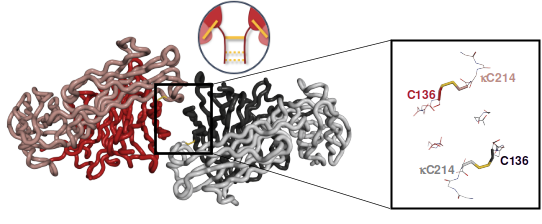

## Unlocking the Secret Code of Antibodies: A Data-Driven Journey to Better Therapies

Imagine a world where our body’s own defenders—antibodies—can be fine-tuned like the gears in a precision watch to better fight infections and cancer. With the help of data-driven methods, I helped my collaborators uncovered how tiny changes in an antibody’s “hinge” region can dramatically affect its performance. This discovery not only sheds light on the inner workings of our immune system but also opens the door to engineering next-generation therapeutics using data-driven methods.

---

### The Challenge of Fine-Tuning Antibodies

Antibodies are proteins that help our body identify and neutralize harmful invaders. Among them, the IgG2 class stands out. Unlike its relatives, IgG2 has a unique hinge—a flexible connector that can rearrange its chemical bonds. This ability, known as disulfide shuffling, acts like a molecular switch, controlling how the antibody binds to immune receptors and, in turn, how it activates the immune response. However, for years scientists puzzled over exactly how this tiny hinge could make such a big difference.

  <figure style="margin: 0;">
    
    <figcaption style="text-align: center; margin-top: 0.5rem;">A F(ab)2 fragment of IgG2. Each pair of cyan beads are connected by a hinge bond</figcaption>
  </figure>
  <figure style="margin: 0;">
    
    <figcaption style="text-align: center; margin-top: 0.5rem;">"Wagging" mode of disulfide shuffling</figcaption>
  </figure>

---

### A Data-Driven Detective Story

We set out to solve this mystery by combining a host of powerful tools. we started by tweaking the antibody’s structure at the molecular level, swapping out specific building blocks (amino acids) to see how these changes affected its behavior. Using X-ray crystallography (MX) detailed snapshots of the antibody’s shape can be captured. MX revealed that when a particular “disulfide crossover” forms and Small-angle X-ray Scattering showed the molecule adopts a compact, less flexible structure.

  <figure style="margin: 0;">
    
    <figcaption style="margin-top: 0.5rem;">Ribbon representation of F(ab)2 structure determined with detailed inset view. The proposed disulfide pattern shows that a disulfide crossover forms between two antibody chains. This unique disulfide arrangement result in that the antibody to adopt a more compact conformation.</figcaption>
  </figure>

  <figure style="margin: 0;">
    
    <figcaption style="margin-top: 0.5rem;">Ribbon representation of F(ab)2 structure determined  with detailed inset view. The proposed disulfide pattern shows only "paired ladders" form within hinge region. This structure tends to be more flexible.</figcaption>
  </figure>

But the story didn’t stop there. I used rigid-body model to create thousands of models of the antibody in a kinematical space. Using evolution algorithms driven by experimental data, we discovered a clear pattern: antibodies that were more rigid due to the specific hinge configuration were far better at triggering immune receptor signals. In essence, the compact structure acted like a lock, holding immune receptors close together to start a powerful defensive response.

  <figure style="margin: 0;">
    
    <figcaption style="overflow-wrap: break-word; hyphens: auto; margin-top: 0.5rem;">Specific offspring are selected based on their ability to fit experimental data, guiding the next generation of models. This evolutionary algorithm exemplifies an unsupervised machine learning approach, optimizing structures without explicit human intervention.</figcaption>
  </figure>
  <figure style="margin: 0;">
    
    <figcaption style="overflow-wrap: break-word; hyphens: auto; margin-top: 0.5rem;">Multiple recycles with various seeds allow the reinforcement of statistical significance. This data-driven optimization reinforces the reliability of the predictions. The population distribution at the end of the modeling expresses the best fitted subensembles.</figcaption>
  </figure>

  <figure style="margin: 0;">
    
  </figure>
  <figure style="margin: 0;">
    
  </figure>

<figcaption style="overflow-wrap: break-word; hyphens: auto; margin-top: 0rem;">Orientation of F(ab)2 arms for optimized ensembles in the flexible A-form (left) and compact B-form (right).
The orientations are plotted using spherical coordinates, where the vertical (z) axis aligns through the hinge region, while the other two angles effectively describe the "wag" and "bend" motions. Each conformer is represented by a pair of dots on the hemisphere surface, indicating endpoints of the arm vector. These dots illustrate the conformational space sampled after fitting to the experimental SAXS data. Dot colors correspond to the frequency of selected conformations (jet palette: red–high, green–medium, blue–low), and their size is proportional to population abundance. The red halo indicates the total configurational space accessible to candidate structures within the constraint pool, while the highlighted lines emphasize the five most representative conformers from each ensemble.
</figcaption>

  <figure style="margin: 0;">
    
    <figcaption style="margin-top: 0.5rem;">Full scope on the conformational states of F(ab)2 fragments revealed by data-driven optimization. (A) Distribution of structures for all variants plotted against their calculated Rg values, where the initial conformational pool is shown in gray, and the results manifested from the evolution algorithm is shown in color; increasing
agonistic activity from red to blue (B) Agreement of the calculated scattering curve from the reweighted ensemble with experimental SAXS data (gray dots) as indicated by &#967;2 fit; the error-weighted residual plot below. (C) Representative conformational states are shown with one of the F(ab) arms aligned (gray) and the second F(ab) arm colored; color saturation indicates contribution to the ensemble.
    </figcaption>
  </figure>

This data-driven approach is a game changer. By understanding how subtle structural shifts control an antibody’s activity, we can now envision designing therapies that precisely regulate the immune system. Whether it’s ramping up the immune response against tumors or dialing it down to treat autoimmune diseases, this research provides a molecular blueprint for safer and more effective treatments.

&nbsp;

---

### From Lab Bench to Real-World Impact

The work behind these discoveries is a perfect example of how combining rigorous experiments with advanced data analysis can solve complex biological puzzles. The team’s journey—merging engineering, structural biology, and computational modeling—demonstrates the power of data-driven methods to address real-world health challenges. Their findings not only deepen our understanding of the immune system but also pave the way for innovative therapies that could transform patient care.

&nbsp;

---

## Tech Stacks

- **Programming & Data Analysis**  
  Python (NumPy, pandas, SciPy), – extensive data manipulation, statistical analysis, and model implementation.

- **Machine Learning & AI**  
  supervised and unsupervised learning tasks, including advanced ensemble modeling and simulation optimization.

- **Data Visualization & Communication**  
  matplotlib, Plotly, transforming complex datasets into clear, compelling visualizations. Turning static structural data into informative, dynamic representations.

- **Computational Modeling & Simulation**  
  molecular dynamics (Amber), structural modeling, and conformation analysis, integrating simulations with real-world experimental data to validate predictions.

- **Interdisciplinary Collaboration**  
  combining biological research expertise with advanced data science methods to deliver actionable insights and robust analytical solutions.

---

## Insights & Highlights

- **Advanced Biological Data Analysis**  
   Handling complex biological datasets, integrating multi-modal experimental data (MX,SAXS) and computational modeling.

- **Versatile Data Processing**  
   Utilized various data analysis techniques, from initial data preprocessing and dimensionality reduction to detailed statistical analysis, ensuring robust and reproducible outcomes.

- **Data-Driven Structural Modeling**  
   Transformed static structural images into meaningful conformational distributions using evolutionary algorithms and unsupervised machine learning methods to optimize model selection based on experimental constraints.

- **Scientific Visualization and Interpretation**  
   Converted complex datasets into intuitive visualizations (3D spherical coordinate plots, color-coded distribution maps) that clearly communicate sophisticated insights, enhancing understanding among diverse audiences.

- **Computational Simulation & Ensemble Analysis**  
   Applied molecular dynamics simulations and genetic algorithms to systematically sample structural conformations, validating these against experimental data, thus reinforcing statistical significance and model reliability.

---

## Explore the Project

Read the full paper on <a class="inline-link" href="https://www.science.org/doi/10.1126/sciimmunol.abm3723">Science Immunology</a>.

---

_In today’s era of personalized medicine, this research reminds us that even the smallest molecular switches can have enormous consequences. By harnessing the power of data, we are now one step closer to turning the body’s natural defenses into finely tuned instruments for healing._
