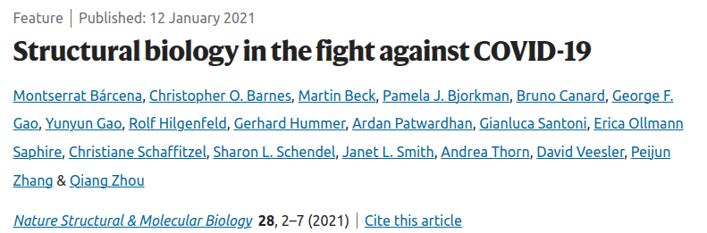
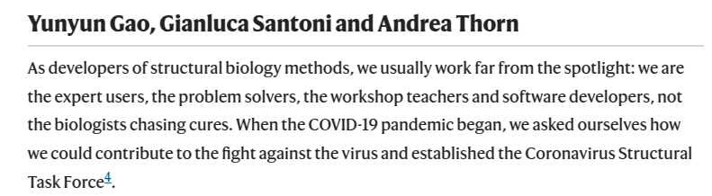
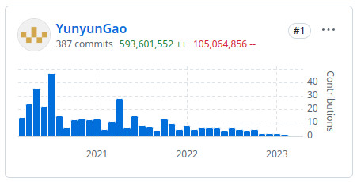

<h2>Structural Biology with Modern CI/CD:  the Coronavirus Structural Task Force</h2>

<a class="inline-link" href="https://github.com/resources/articles/devops/ci-cd" target="_blank">Continuous Integration and Continuous Deployment (CI/CD)</a> isn't just for tech startups anymore. When I joined the initiative, the <a class="inline-link" href="https://github.com/thorn-lab/coronavirus_structural_task_force" target="_blank">Coronavirus Structural Task Force</a>, I believe it was possible to use industry-standard DevOps practices to revolutionize urgent scientific research task.

When the COVID-19 pandemic emerged, structural biologists faced unprecedented urgency to decode the virus's proteins for drug development. This led to rapid structure generation, but also increased risk of errors. To tackle this, I, as the major pipeline developer  and grouped with other scientists, established an automated pipeline remarkably similar to CI/CD workflows familiar in software engineering.

    

        <figure class="image-container">
            
        </figure>
        <figure class="image-container">
            
        </figure>
    

    <figcaption style="text-align: center; margin-top: 0.5rem;">
    Together with other scientists, we fight against COVID-19.
    </figcaption>

    &times;
    

        
    

The whole Coronavirus Structural Task Force project is more than CI/CD. Check our <a class="inline-link" href="https://www.nature.com/articles/s41594-021-00593-7" target="_blank">Nature Molecular & Structural Biology</a> paper.

---

### How the Pipeline Works

**Continuous Integration:** Every Wednesday, new viral protein structures published in the Protein Data Bank (PDB) are automatically integrated into the Task Force's infrastructure.

**Automated Testing & Validation:** Structures undergo rigorous, automated quality checks (using Docker container to host different tools like MolProbity, AUSPEX, XDS, STARANISO), quickly identifying issues such as misalignment and incorrect residue modeling.

**Manual Refinement:** Detected errors trigger a "manual debugging" phase, where structural biologists refine and correct the models.

**Continuous Deployment:** Validated and corrected structures are immediately deployed publicly at <a class="inline-link" href="https://insidecorona.net/" target="_blank">insidecorona.net</a> and <a class="inline-link" href="https://3dbionotes.cnb.csic.es/ws/covid19" target="_blank">3D-bionotes</a>, providing real-time, accurate data for researchers worldwide.

---

### Tech Stacks:

**Containerization & Deployment:**  
Docker, for encapsulating analysis tools

**Automated CI/CD Pipeline:**  
Github CI/CD (for automation and scheduling)\
Cron scheduling for weekly data integration

**Data Processing & Validation Tools:**  
MolProbity (model validation and quality assessment)\
AUSPEX (crystallographic data quality visualization)\
XDS (X-ray diffraction data processing)\
STARANISO (anisotropic diffraction data analysis)

**Database & Storage:**  
SQL databases (for structured storage and querying of validation results)\
wwPDB integration for structural data sourcing

**Visualization & Frontend:**  
Interactive visualization (integrated with tools like Proteopedia and 3D-Bionotes)\
Web deployment for public accessibility (insidecorona.net)

**Collaboration & Communication:**  
Git (version control)\
Issue tracking and management (GitHub Issues)\
Real-time communication and collaboration (We are from 8 different time zones!). \
Check how we manage this on <a class="inline-link" href="https://www.nature.com/articles/s41594-020-00544-8#Sec6" target="_blank">this feature report on Nature Molecular & Structural Biology</a>.

---

### Insights & Highlights

**Rapid Automated Feedback:** Mimicking tech CI/CD principles enables quick error identification and resolution, significantly enhancing data quality.

**Transparency & Accessibility:** Automated public deployments ensure global, equitable access to high-quality structural biology data, accelerating downstream applications like drug discovery.

**Iterative Improvement:** Regular cycles of integration, testing, and deployment foster continual enhancement in scientific models.

- **What I achieved in the project**:
  - Automation of complex data pipelines
  - Continuous integration tools and methodology
  - Real-time automated quality assurance
  - Data visualization and public deployment
  - Cross-disciplinary collaboration

    <figure>
        
        <figcaption style="text-align: center; margin-top: 0.5rem;">
        Top contributor of Corona Structure Task Force
        </figcaption>
    </figure>

---

## Explore the Project

For more details about the project, check out the <a class="inline-link" href="https://github.com/thorn-lab/coronavirus_structural_task_force">CSTF on Github</a>.

_By embracing tech-inspired CI/CD workflows, the Coronavirus Structural Task Force not only improves scientific outcomes but also illustrates how software engineering practices can significantly impact scientific innovation. This cross-pollination of skills is a valuable lesson for tech companies looking to innovate in scientific or data-intensive environments._
