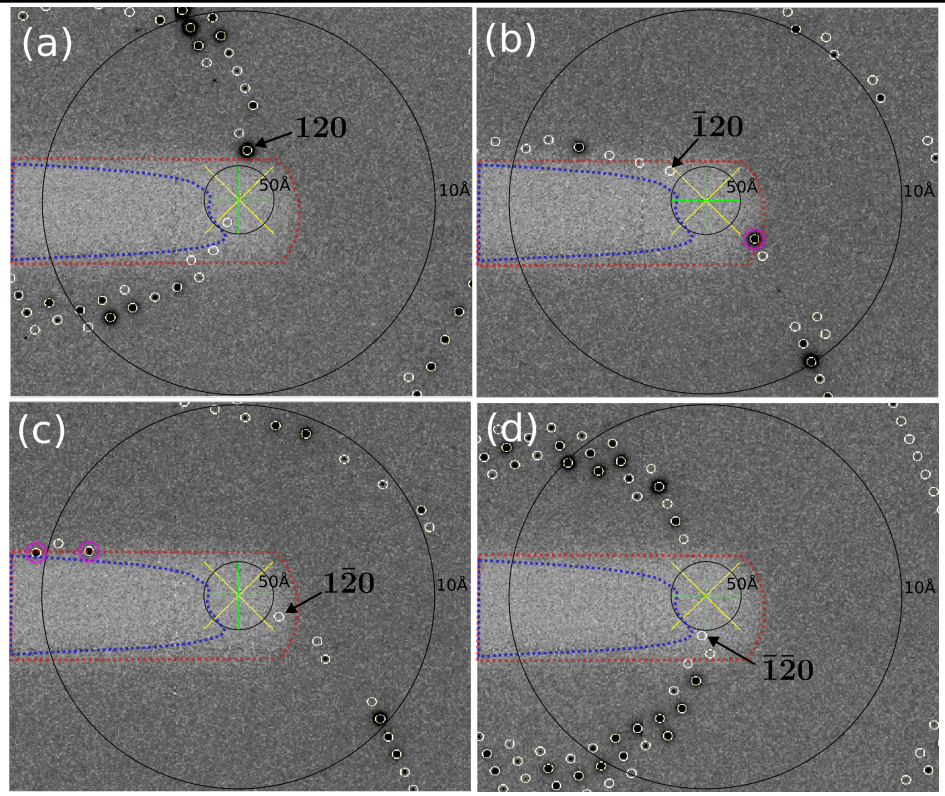
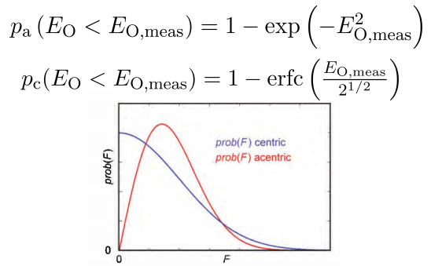
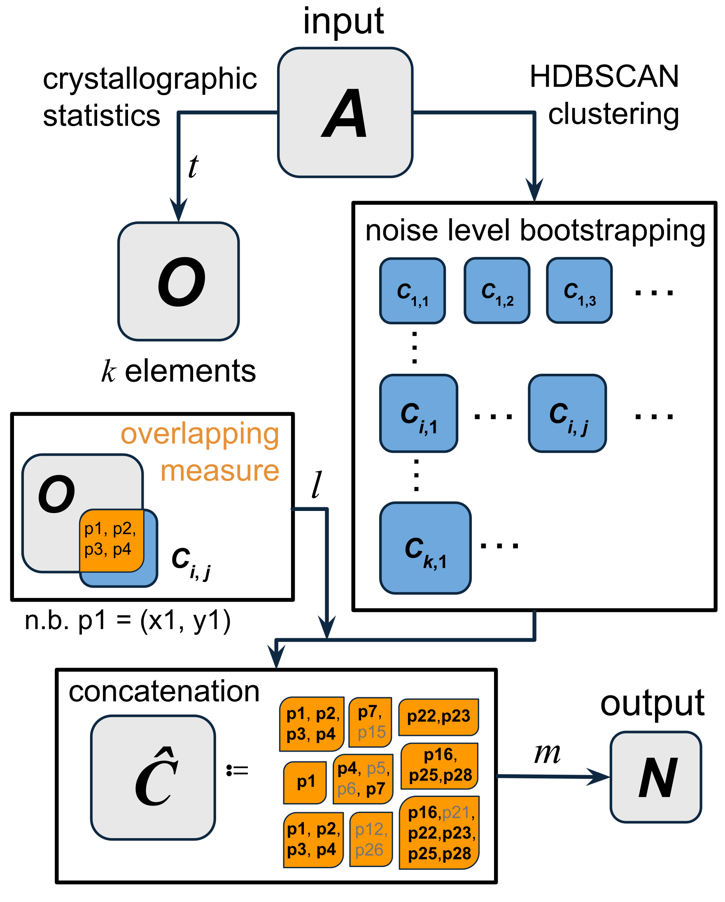

<link rel="stylesheet" href="../app/popup-polygon-editor.css">
<link rel="stylesheet" href="https://cdnjs.cloudflare.com/ajax/libs/font-awesome/6.4.0/css/all.min.css">

<h2>Finding NEMOs: Weaving a Better Fishing Net with Statistics, Clustering, and Machine Learning</h2>

Imagine you're exploring the vast ocean of scientific data. Among countless useful data points swimming around freely, there are sneaky creatures hiding quietly in the shadows. They look harmless, even normal, but they can cause significant issues if they're not caught early. In crystallography, we call these stealthy troublemakers <a class="inline-link" href="https://auspex.physnet.uni-hamburg.de/pathol/#2" target="_blank">"NEMOs"—Not-Excluded-unMasked-Outliers</a>. In this project, the task was to catch them. 

You can read the full paper <a class="inline-link" href="https://journals.iucr.org/d/issues/2024/10/00/rr5246/" target="_blank">here</a> or have fun with the <a class="inline-link" href="../pdf/NEMO-Finder.pdf" target="_blank">poster</a>.

---

### Why Traditional Methods Couldn't Catch NEMOs

In <a class="inline-link" href="https://phys.libretexts.org/Courses/University_of_California_Davis/Biophysics_200A%3A_Current_Techniques_in_Biophysics/X-ray_Protein_Crystallography" target="_blank">macromolecular X-ray crystallography</a>, scientists collect diffraction patterns to determine the structures of proteins. Sometimes, however, parts of the detector shadowed by a so-called "beamstops". Outliers arise from reflections within areas shadowed by improperly masked or partially masked beamstops are much trickier to handle. Traditional statistics are good at identifying clearly anomalous data, but these NEMOs are different to catch because the statistical filters are simply not robust enough to handle the subtle nature of NEMOs.

  <figure style="margin: 0;">
    
    <figcaption style="text-align: justify; margin-top: 0.5rem;" >
    Example of the experimental origin of NEMOs. The blue dashed polygon highlights the edge of excluded shaded regions recognized by the beamstop mask autogen program. The red dashed polygon highlights the edge of how one would intuitively define a mask, manually created. The beam centre is indicated by the yellow and green crosses. The 50 and 10 Å resolution shells are marked with black rings. Predicted locations of reflections are circled in yellow. Using the blue mask, the similarity of observations 120 in (b),120 in (c) and 120 in (d) result in the exclusion of observation 120 in (a). The resulting merged unique reflection 120 would then have a value close to 0, but an `algorithm-acceptable' uncertainty. Using the red mask, the unique reflection 120 can be properly recorded, as the other symmetry-equivalent observations are completely masked. However, in (b) and (c) such a mask results in the masking of unbiased observations (magenta circles).
  </figcaption>
  </figure>

    <button id="openEditor" class="open-button">Open Beamstop Mask Editor</button>
    

    If you have checked the <a class="inline-link" href="/pdf/NEMO-Finder.pdf" target="_blank">poster</a>, you might want to play with this Beamstop Mask Editor to see if you can generate a perfect beamstop mask. I myself made this generator to show a thought-to-be-easy task is actually quite demanding.
    

Think of traditional statistics as fishing with a simple and uniform net: great for catching obvious, large fish, but these NEMOs are like tiny, stealthy fish slipping right through. Something smarter, subtler, and more adaptive was needed. One important problem with traditional statistics "net" is that once the "mesh size" is set, adaptive cannot be performed based on the data.

  <figure style="margin: 0;">
    
    <figcaption style="text-align: justify; margin-top: 0.5rem;">
    In X-ray crystallography, weak intensities are a normal part of the data. Traditional statistical methods typically rely on assumptions that work well for stronger signals. However, when the intensities are weak, the inherent noise can blur the line between genuine data and outliers. This makes it challenging for conventional statistics to distinguish between normal, albeit weak, signals and those that are genuinely problematic, leading to either false positives or missed detections of outliers. Image source: <a  href="https://www.ruppweb.org/Garland/default.htm" target="_blank">Rupp's X-ray crystallography</a>.
  </figcaption>
  </figure>

---

### Designing a Better Net

To catch NEMOs, I needed a system that understood patterns intuitively. I decided to blend crystallographic statistics with a powerful clustering technique called <a class="inline-link" href="https://scikit-learn.org/stable/modules/clustering.html#hierarchical-clustering" target="_blank">Hierarchical Density-Based Clustering (HDBSCAN)</a>. The idea was straightforward: first, use crystallographic statistics to identify a set of suspect reflections, and second, let clustering algorithms find persistent groupings among these suspects. Some preparation is needed before starting using machine learning.

<strong>Data Preparation:</strong> Extracted relevant data points, specifically weak reflections, at low-resolution regions. NEMOs are more likely to be found at low-resolution regions because the automated beamstop mask generator cannot properly handle the beamstop shadow at the center of the detector.

<strong>Initial Statistics Screening:</strong> Applied traditional crystallographic probability methods to identify potential outliers.

<strong>Clustering abd Bootstrapping:</strong> Used a multi-stage bootstrapped HDBSCAN runs to iteratively refine the clustered groups by tuning the minimum cluster size. This way I can explore multiple noise level without a presumption on how noise the dataset is. In X-ray crystallography, the noise level is usually determined by the symmetry of the crystal and the size of the protein motif.

  <figure style="margin: 0;">
    
    <figcaption style="text-align: justify; margin-top: 0.5rem;">
    Schematic workflow of the NEMOs-Finding net. The process begins with a low-angle data subset A. Subsequently, crystallographic statistics and clustering bootstrapping are performed independently. The overlap between each subcluster Ci,j and the set O derived from crystallographic statistics is then assessed. This results in the concatenated multiset C&#770;, where elements can be recurrent with a certain multiplicity. If an unique element has sufficient multiplicity, it will be included in the output set N and categorized as a NEMO. The detection performance is influenced by the hyperparameters t, l and m. Here, an element p is equivalent to indexed 2D coordinates with (x, y) as positional properties in a Euclidean plane.
  </figcaption>
  </figure>

---

### Teaching the Net to Adjust: Semi-Supervised Machine Learning

Simply combining statistics and clustering wasn't enough. I needed to optimize this net so it didn't accidentally catch healthy data (false positives) or miss actual NEMOs (false negatives). This is where machine learning stepped in. For that,I took a semi-supervised learning approach.

<strong>Creating Ground Truth:</strong> I manually curated and verified a dataset by visually inspecting diffraction images and labeling genuine NEMOs. This step was crucial—careful data curation laid the groundwork for accurate model training.

<strong>Hyperparameter Optimization:</strong> I performed iterative optimization of the model's hyperparameters. Using techniques such as Monte Carlo sampling and Tree-structured Parzen Estimator (TPE), I tuned the algorithm until it reliably separated genuine NEMOs from healthy reflections across various conditions.

<strong>Validation and Performance Metrics:</strong> With carefully chosen metrics (precision, accuracy, sensitivity, and specificity), I continuously evaluated the model, ensuring it performed robustly even with challenging datasets.

This approach significantly improved the model's ability to differentiate true outliers from innocent bystanders, reducing both false alarms and overlooked NEMOs.

<!-- Table --> 
<iframe
    src="../app/nemos-table.html" 
    width="550" 
    height="250" 
    style="border: none; display: block; margin: 20px auto;"
    title="Data Table"
    loading="lazy"
    >
    Your browser doesn't support iframes.
</iframe>
<!-- End of Table -->

---

### Weaving the Perfect Fishing Net: An Integrated Approach

The true strength of the solution wasn't just statistics, clustering, or machine learning individually, it was how I integrated them. By first screening reflections statistically, then clustering based on density, and finally refining via semi-supervised learning, I created a comprehensive, adaptive net to reliably catch NEMOs automatically.

 Think of this as fishing smartly: using initial sonar (statistics) to detect likely areas, then casting an adaptive net (HDBSCAN), and finally adjusting this net's size and shape (machine learning) based on continuous feedback from the environment.

Ultimately, the solution made a <strong>30% performance improvement</strong> over the traditional method.

---

### Technical Highlights

- Integrated traditional crystallographic statistics with advanced machine learning techniques.

- Expertly curated and cleaned a robust training dataset through meticulous inspection and verification.

- Implemented semi-supervised hyperparameter tuning to maximize accuracy, reducing false positives and false negatives.

---

_Just like finding Nemo required ingenuity, perseverance, and teamwork, "Finding NEMOs" combined statistical insight, clustering innovation, and adaptive machine learning. This project not only illustrates my ability to abstract and solve complex data problems but also demonstrates practical skills in data curation, model training, and parameter tuning—valuable expertise ready to tackle real-world challenges in industry and academia._

    

        

            <!-- Canvas Container -->
            

                <canvas id="canvas"></canvas>
            

            <!-- Vertical Controls on the Right -->
            

                <!-- Drawing Controls -->
                

                    <button id="drawMask" class="control-button"><i class="fas fa-pen"></i> Draw Mask</button>
                    <button id="clearAll" class="control-button"><i class="fas fa-trash"></i> Clear All</button>
                
            
                <!-- Image Adjustment Controls -->
                

                    <h3>Image Adjustments</h3>                
                    

                        <label for="brightnessSlider">Brightness</label>
                        

                            <input type="range" id="brightnessSlider" min="-1" max="1" step="0.01" value="0">
                            0.00
                        

                    
                
                    

                        <label for="contrastSlider">Contrast</label>
                        

                            <input type="range" id="contrastSlider" min="-1" max="1" step="0.01" value="0">
                            0.00
                        

                    
                   
                    

                        <label for="gammaSlider">Gamma</label>
                        

                            <input type="range" id="gammaSlider" min="0.1" max="2.2" step="0.01" value="1">
                            1.00
                        

                    

                
              
                <!-- Tips Section -->
                

                    <h4>Mask the shadow but not any reflection</h4>
                    <ul>
                        <li>Maximize the window for the full image</li>
                        <li>Use the sliders to highlight the shadow</li>
                        <li>Click "Draw Mask" to start drawing</li>
                        <li>Close the mask by double-clicking</li>
                        <li>Double-click on a mask to edit vertices</li>
                        <li>Single-click on a mask to transform</li>
                        <li>Click "Clear All" to clear all masks</li>
                    </ul>
                

                

                

                    <button id="closeEditor" class="close-button"><i class="fas fa-times"> Close Window</i></button>
                

            

        

    

<!-- Load Fabric.js library -->

<!-- Load the core polygon editor functionality first -->

<!-- Then load the main popup script -->

