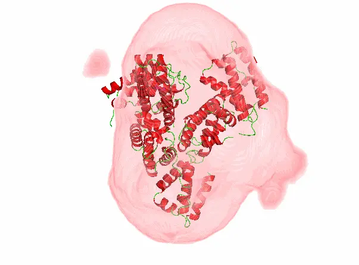
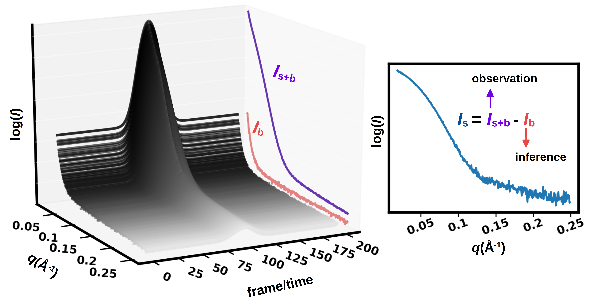
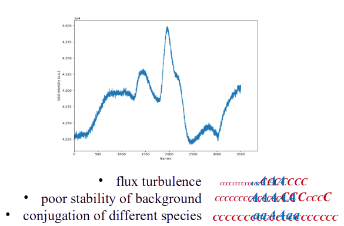
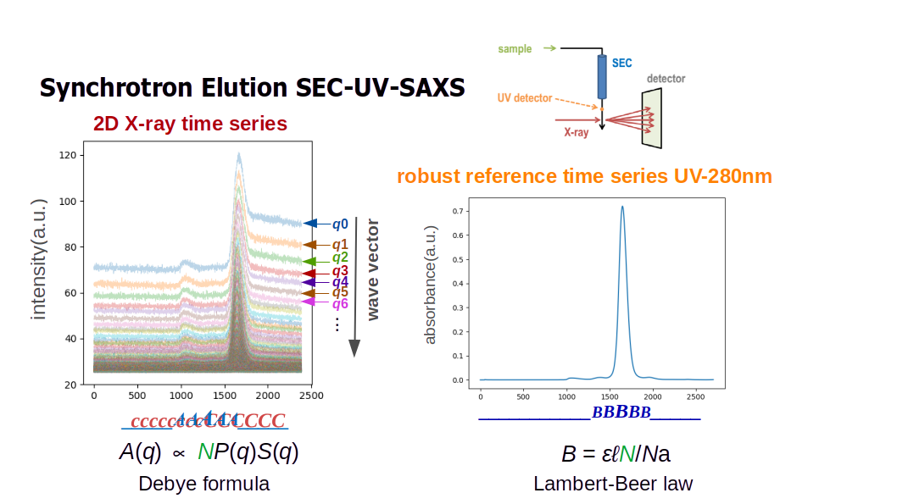

## Evaluate the Fidality of SEC-SAXS Time Series 

**TL;DR:** Polluted noisy time series can be rescued by a fiedality estimator (correctness-state score) without making subjective decision

**Result Showcasing:**

  <figure style="margin: 0;">
    
    <figcaption style="text-align: center; margin-top: 0.5rem;">Result with Bad Data</figcaption>
  </figure>
  <figure style="margin: 0;">
    
    <figcaption style="text-align: center; margin-top: 0.5rem;">Result with Good Data</figcaption>
  </figure>

### Information Extraction is Hard because Subjectivite Decision

  The <a class="inline-link" href="https://en.wikipedia.org/wiki/Biological_small-angle_scattering">solution SAXS</a> pattern of a molecule is inherently ambiguous due
  to its isotropic nature. Although several general parameters can be obtained through rigorous analytical
  interpretation of SAXS data, the correctness of the interpretation is largely affected by the basic data characteristics, such as accuracy of the background subtraction,
  evaluation of the structure factor (i.e polydispersity and intermolecular interactions),
  assessment of the meaningful data range, and estimation of the appearance of radiation
  damage. Because the SAXS profile lacks correlated measured outputs, it is
  hard to statistically provide an objective assessment of these crucial data qualities. A common
  situation for the SAXS user is that data interpretation can only be performed in an ill-posed
  manner, meaning the solution is not unique or the solution procedure is unstable. Consequently, the
  assessment of data quality is in fact a measurement of solution stability. Unfortunately, the stability criteria themselves also include subjective judgement, since many solutions lack an objective standard, and there is no clear dividing line between "many" and "too many".

  In modern synchrotron bio-SAXS experiments in-line chromatography has been introduced
to separate the often complex mixtures that occur in these samples, for example, the mixture
of protein-detergent complexes, oligomers and empty micelles/vesicles that occur even in
well behaved membrane protein samples. By separating any potential contaminants and
different components of mixtures (conformational or compositional) using a chromatographic
column, chromatography-SAXS facilitates ideality and weak mono-dispersion of the
biological particles under study. When sample is delivered through a SEC coumn, it is called SEC-SAXS.

  <figure style="margin: 0;">
    
    <figcaption style="text-align: center; margin-top: 0.5rem;">
      Dataset from <a class="inline-link" href="https://pmc.ncbi.nlm.nih.gov/articles/PMC6276278/">SEC-SAXS</a> are 2D time series (technically 3D, but azimuthal integration can be used to reduce the dimensionality). The sample is delivered to the X-ray beam using an HPLC system, and when the sample reaches the beam, the response appears at a predefined Shannon channel (or wave vector). Under ideal conditions, the time series at all Shannon channels resemble Gaussian distributions. Given the observed signal (Is+b), the background (Ib) can be easily inferred.
    </figcaption>
  </figure>

### The Harsh Reality 

However, in reality, ideal conditions do not exist. In actual experiments, various issues arise. For example, flux turbulence can cause sudden changes in total signal. HPLC stability may be poor, alternating between fast and slow pumping. Additionally, overlapping species can complicate the analysis.

  <figure style="margin: 0;">
    
    <figcaption style="text-align: center; margin-top: 0.5rem;">
      This is the actual dataset. I don't even know where the protein peak is. Image the protein signal is a series of A and the background is a series of C. Many factors can affect the accurate evaluation of A series and C series.
    </figcaption>
  </figure>

### Solution: Use Conjugate Prior EXPERIMENTALLY determined!

 The chromatographic signal is normally measurement of a certain molecular property, such as refractive index, light scattering or absorption at 280 nm. The X-ray scattering elution trace is a measurement of the total X-ray scattering of the sample and its surrounding environment (buffer, sample capillary). It is important to realise that the chromatographic signal and the X-ray scattering signal are essentially two correlated time series. chromatographic signal and X-ray scattering elution trace in the same experiment both respond to the sample concentration and are hence correlated. As long as the weak monodispersity and non-interaction assumptions hold, the resulting background corrected time series of the X-ray scattering intensity at each shannon channel, is semantically similar to the chromatographic signal. This can be used as a conjugate prior to help us objectively get rid of Ib from our X-ray time series. 

  <figure style="margin: 0;">
      
    <figcaption style="text-align: center; margin-top: 0.5rem;">
      The configuration of SEC-UV-SAXS. Here the UV-280nm acts as a robust reference time series ac UV light is much less intrusive than X-ray for protein. 
    </figcaption>
  </figure>

### And Some Machine Learning Tricks

